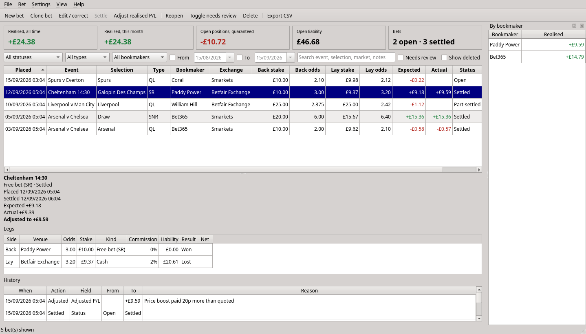
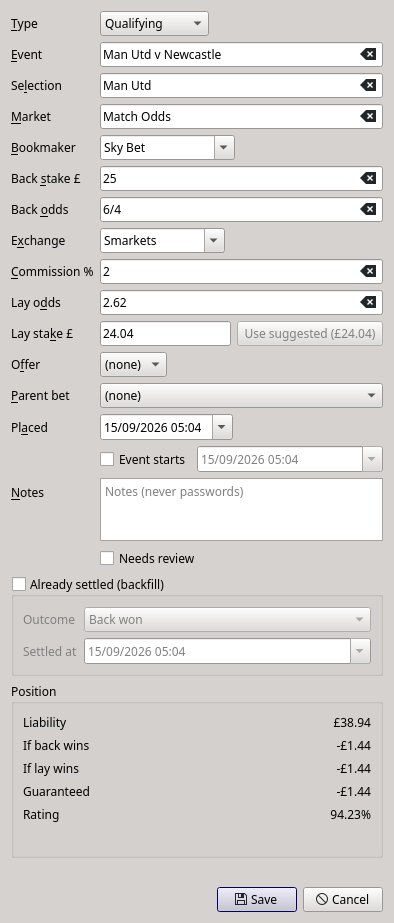

# odds-pup

A small desktop app for matched betting. Log qualifying bets & free bets with their lay
bets, see the guaranteed result before you place them, settle them with what actually happened,
and keep a full history of every change.



- **Calculator and record in one.** Type the back stake, back odds, lay odds and commission. The
  app fills in the lay stake that evens out both outcomes and shows the liability, the profit or
  loss either way, and the rating. Change the lay stake to what actually matched and the figures
  follow.
- **Qualifying bets, free bets (SNR) and free bets (SR).** Odds can be
  decimal (`2.375`) or fractional (`11/8`, `evens`).
- **Settle with the real outcome:** back won, lay won, void, or per leg for cash-outs and early
  payouts. The realised profit is calculated from the result, not typed in.
- **Nothing is edited silently.** Corrections and manual adjustments need a reason, and every
  change is kept in the bet's history.
- **Totals at a glance:** realised profit all time and this month, the guaranteed result of open
  bets, total open liability (hover over it to see each exchange), and realised profit per
  bookmaker.
- **Private by design.** odds pup stores an SQLite file on your own machine, backed up
  automatically. odds pup never goes online.

## Status

odds pup is new, so expect rough edges and check its
figures against your bookmaker and exchange statements. It keeps records only: it does not place
bets or fetch prices.

| Platform | Support |
|---|---|
| Linux | Supported and tested |
| macOS | Should work, not tested |
| Windows | Not supported (the app will not start) |

It is built for UK matched betting: pounds only, decimal or UK fractional odds, and a starting list
of UK bookmakers and exchanges.

## Install and run

You need [git](https://git-scm.com/) and [uv](https://docs.astral.sh/uv/getting-started/installation/).
uv installs the right Python version and every dependency for you. To install uv on macOS:

```sh
curl -LsSf https://astral.sh/uv/install.sh | sh
```

Then get odds-pup and start it:

```sh
git clone https://github.com/sophietheopossum/odds-pup.git
cd odds-pup
uv run odds-pup
```

The first run downloads Python if needed and the Qt toolkit (PySide6, about 700 MB once
installed), so it takes a few minutes. Later runs start straight away.

To update, pull the latest version and start it as usual. If a new version changes the database
format, odds-pup backs up your db before converting it.

```sh
git pull
uv run odds-pup
```

### If it will not start on Linux

If you see `Could not load the Qt platform plugin "xcb"`, install the X11 cursor library that Qt
needs. On Debian or Ubuntu:

```sh
sudo apt install libxcb-cursor0
```

## Using it

1. **Set your commission rates.** Open **Settings → Bookmakers and exchanges** and set each
   exchange's default commission to what your account actually pays. The starting values
   (Betfair Exchange 5%, Smarkets 2%, Betdaq 2%, Matchbook 4%) are only guesses. The same screen
   holds each exchange's minimum lay stake and price ladder, which drive the warnings below. You
   can also rename a venue to fix a typo everywhere, or delete one that no bet uses.
2. **Add a bet** with **New bet** (Ctrl+N). Choose the type, fill in the event, the bookmaker, the
   back stake and odds, the exchange and the lay odds. The lay stake fills itself in: change it to
   what actually matched. You are warned when the lay odds are not on the exchange's price ladder,
   the lay stake is below its minimum, the commission is above 10%, or a qualifying bet rates below
   80%. Out of the box only Betfair Exchange has a ladder (and a £2 minimum), and Smarkets a 5p
   minimum. Tick **Already settled** to record a past bet.
3. **Settle it** with **Settle** (Ctrl+Return). For an ordinary result click **Back won**,
   **Lay won** or **Void**. For a cash-out or early payout, leave those buttons alone and use the
   **Per leg** section instead:
   - On the bookmaker leg choose **Cashed out** and enter what the bookmaker credited. For a cash
     bet that includes your stake: a £10 bet paid out early at 2.00 returns £20. For a free bet,
     enter exactly what was credited.
   - If you cashed out on the exchange, set the lay leg to **Cashed out** and enter the profit or
     loss the exchange shows. Otherwise give it its result, or leave it pending and settle it
     later.
   - Press **Apply per-leg results**.
4. **Adjust** (Ctrl+J) a settled bet when the real profit differs from the maths, such as a price
   boost paid later. A reason is required, and the bet is marked as adjusted.
5. **Fix mistakes.** **Edit** (Ctrl+E) an open bet freely. Once any leg has a result, Edit becomes
   a correction that needs a reason. **Reopen** (Ctrl+R) puts settled legs back to pending.
   **Delete** hides a bet from the ledger and every total. Tick **Show deleted** to find it and
   restore it.
6. **Export** (Ctrl+Shift+E) the bets currently shown to a CSV file, one row per leg.



### Keyboard shortcuts

On macOS, use Cmd where this table says Ctrl, and fn+Delete for Delete.

| Action | Shortcut |
|---|---|
| New bet | Ctrl+N |
| Clone the selected bet | Ctrl+D |
| Edit or correct | Ctrl+E |
| Settle | Ctrl+Return |
| Adjust realised profit | Ctrl+J |
| Reopen | Ctrl+R |
| Toggle needs review | Ctrl+M |
| Delete or restore | Delete |
| Search | Ctrl+F |
| Export CSV | Ctrl+Shift+E |
| Refresh | F5 |
| Quit | Ctrl+Q |

In the New bet, Edit and Adjust dialogs, Enter saves and Esc cancels. In the Settle dialog, Enter
applies the per-leg results; click **Back won**, **Lay won** or **Void** for an ordinary result.

### How the numbers are worked out

- The suggested lay stake evens out both outcomes. Write the commission as a decimal (2% is
  0.02). For a qualifying bet or a stake-returned free bet it is back stake × back odds ÷ (lay odds
  − commission). For a stake-not-returned free bet it is back stake × (back odds − 1) ÷ (lay odds −
  commission).
- Exchange commission comes only out of exchange winnings, so only when the lay wins.
- **Expected** is the worse of the two outcomes when the bet was placed. That is the figure you can
  count on, not an average.
- **Rating** is the share of your stake you keep (or, for a stake-not-returned free bet, the share
  of the free bet you turn into cash).
- Money is counted in whole pence and rounded half up.

`docs/SPEC.md` has every formula, the rounding rules and worked examples.

## Your data

The ledger lives outside the repository, in your user data folder:

| Platform | Folder |
|---|---|
| Linux | `~/.local/share/odds-pup` (or `$XDG_DATA_HOME/odds-pup`) |
| macOS | `~/Library/Application Support/odds-pup` (or `$XDG_DATA_HOME/odds-pup`) |

To use another folder, start the app with `uv run odds-pup --data-dir /path/to/folder`, or set the
`ODDS_PUP_DATA_DIR` environment variable. Only one copy of odds-pup can have the same data folder
open at a time.

- **Backups** are taken every time the app starts, and whenever you choose **File → Back up now**.
  The newest 10 are kept in the `backups` folder inside the data folder.
- **Restoring a backup:** close odds-pup. In the data folder, move `odds-pup.sqlite3` somewhere
  safe, together with any `odds-pup.sqlite3-wal` and `odds-pup.sqlite3-shm` files next to it.
  Those two are left behind if odds-pup did not close normally and belong to that ledger, so keep
  all three together and never leave them next to a different database. Then copy a backup from
  the `backups` folder into the data folder and rename it `odds-pup.sqlite3`. Backups are named by
  the date and time they were taken, in UTC.
- **Moving to another computer:** close odds-pup on both computers and copy the whole data folder
  across. If the other computer already has an odds-pup data folder, replace it rather than
  copying into it.
- **Privacy:** the folder and its files are readable only by your user account. Your betting
  history is personal: keep it out of shared folders and never commit it to a repository.

## What it does not do (yet)

No live odds or odds matching, no bookmaker balance tracking, no sync between computers, and no
currencies other than pounds. It has no screens for dutching, offers or importing old records from
a spreadsheet, and it does not handle each-way bets, Rule 4 deductions or dead heats.
`docs/SPEC.md` lists what is planned.

## Development

```sh
uv run pytest                                          # tests; Qt runs offscreen
uv run ruff check . && uv run ruff format --check .    # lint and formatting
uv run mypy                                            # type checks
```

```
src/odds_pup/core      calculator and domain rules (no Qt, no database)
src/odds_pup/storage   SQLite storage, backups, CSV export (no Qt)
src/odds_pup/ui        the PySide6 desktop app
tests/                 pytest, including the worked examples from the spec
docs/SPEC.md           the specification: formulas, schema, decisions
```

`CLAUDE.md` has the working rules for agents, many of which apply to contributors as well. `docs/SPEC.md` is the source of truth: change
it first, then the code.

## Licence

[MIT](LICENSE)
